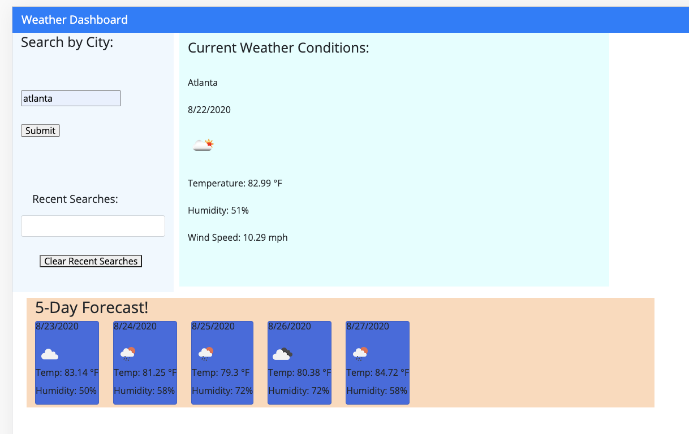

# 06 Server-Side APIs: Weather Dashboard

The website allows the user to type in any City and find out the current weather, as well as the 5-day forecast for that city. Using localStorage, until the user clicks the "Clear Recent Searches" button, the most recent searches will be shown on the screen as well.

Very hard API to work with, took a long time to be able to view the object itself. Was pressed for time, will add more styling later.

## Tech:
html
css
javaScript
bootStrap
jQuery
moment
OpenWeather

## Homework Info

Website:
https://asegre18.github.io/hw6-weather-dashboard/

GitHub Repo:
https://github.com/asegre18/hw6-weather-dashboard

Screenshot:

